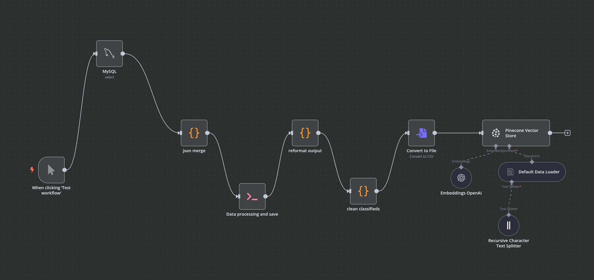
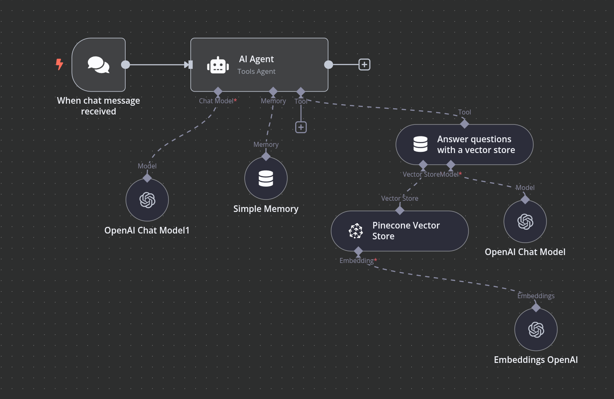
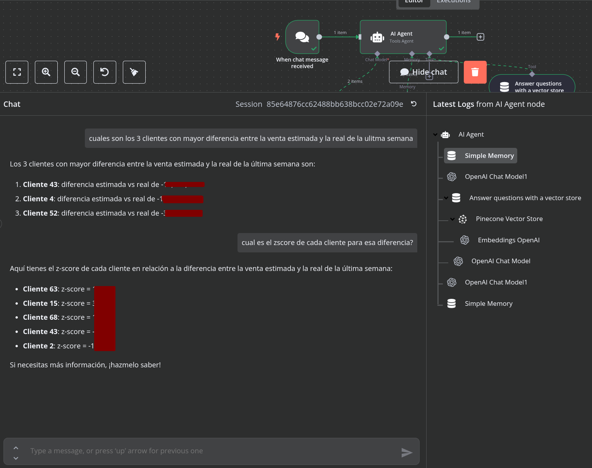

# Workflow Detailed Overview
Example of an AI agent utilizing RAG techniques and an automated processing pipeline.
## Automatic data processing pipeline 

### Key Components

- **Trigger Node** – The trigger is set to clicking trigger for testing purposes but it's meant to be activated periodically using a trigger on schedule.
- **MySQL** – Fetches external data from a MySQL DB.
- **json merge (Code Node)** – Executes JavaScript to merge all JSON objects into a single JSON object.
- **Data processing and save (Execute Command Node)** – Executes a Python script located on the host machine using the preferred Python environment. n8n includes built-in Python support through Pyodide, which is a port of CPython to WebAssembly. However, this built-in option offers only a limited selection of Python packages, and even those available often behave unpredictably. Using a custom environment is the right choice for reasonably complex functionality written in python.
- **reformat output (Code Node)** – When Python is executed through the Execute Command node, the output consists of two JSON objects: stderr and stdout. The stderr field contains a string with any error or warning messages, while stdout contains a string with all printed data and messages from the script. This is how you effectively "return" a value or object to be used in the next node. This node is responsible for extracting the value of the stdout field, which contains the actual JSON output printed by the Python script, and passing it to the following node.

- **clean classifieds (Code Node)** – This node is responsible for removing sensitive data that will later be processed by the LLM. The goal is to avoid sharing classified company information or any other data you wouldn’t want to expose to the provider running the model.

- **Convert to File** – This node converts the JSON into a CSV file and passes the resulting binary data to the next node.

- **Pineconce Vector Store** - This node stores the processed data in a vector database. It uses OpenAI embeddings (I used the text-embedding-3-small) to convert the data and then loads it into the database using a Recursive Character Splitter, which works well for most use cases, including this one. In this case, I used a chunk size of 1000 and an overlap size of 60.

---

## Agent Chat Integration

The agent chat enables interaction with a user through a chat window in n8n, but is meant to be later connect to a external UI.

### Architecture

The agent workflow is triggered when a message is sent through the chat. I chose GPT-4.0 Mini for both chatting and evaluating the retriever's responses. I connected this retriever, named "Answer Questions with a Vector Store," to the same database we used earlier, enabling the agent to respond to the user using the context stored in the vector database. Finally, a simple memory allows the LLM to access past messages, ensuring coherence throughout the conversation.

### 💬 Example Interaction

Below is an example of how a user interacts with the agent:

